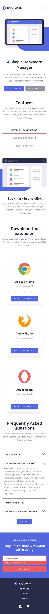
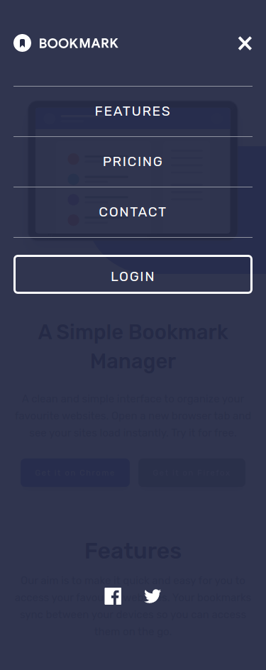
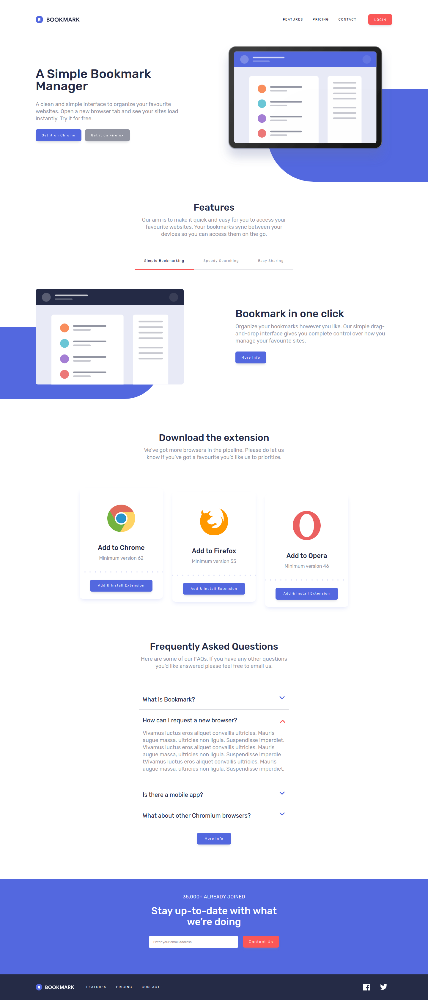
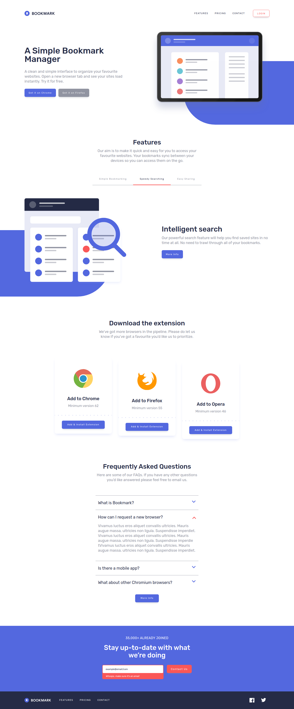

# Frontend Mentor - Bookmark landing page solution

This is a solution to the [Bookmark landing page challenge on Frontend Mentor](https://www.frontendmentor.io/challenges/bookmark-landing-page-5d0b588a9edda32581d29158). Frontend Mentor challenges help you improve your coding skills by building realistic projects.

## Table of contents

- [Overview](#overview)
  - [The challenge](#the-challenge)
  - [Screenshot](#screenshot)
  - [Links](#links)
- [My process](#my-process)
  - [Built with](#built-with)
  - [What I learned](#what-i-learned)
- [Author](#author)

## Overview

### The challenge

Users should be able to:

- View the optimal layout for the site depending on their device's screen size
- See hover states for all interactive elements on the page
- Receive an error message when the newsletter form is submitted if:
  - The input field is empty
  - The email address is not formatted correctly

### Screenshot

### Links

- Solution URL: [Github URL here](https://github.com/atorres-io/frontend-mentor-bookmark-landing-page)
- Live Site URL: [Live site URL here](https://quizzical-euler-07620c.netlify.app/)

## My process

### Built with

- Semantic HTML5 markup
- CSS custom properties
- Vanilla JavaScript (ES6)
- CSS animations
- Flexbox
- ITCSS architecture
- Framekwork methodology

### What I learned

I learned to develop with framework methodology.

## Author

- Instagram - [@atorres.designs](https://www.instagram.com/atorres.designs/)
- Frontend Mentor - [@atorres-io](https://www.frontendmentor.io/profile/atorres-io)
- Github - [@atorres-io](https://github.com/atorres-io)
- Codepen - [@atorres-designs](https://codepen.io/atorres-designs)
- LinkedIn - [@atorresalcala](https://www.linkedin.com/in/atorresalcala)
